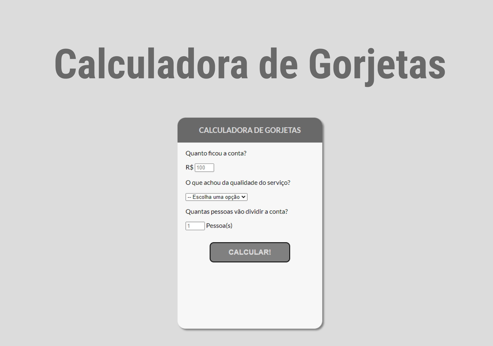

<h1 align="center"> Calculadora de Gorjetas </h1>

Programa exclusivo e gratuito, promovido pela OneBitCode para ensino de tecnologias WEB.  
<a href="https://start.onebitcode.com/?utm_source=biostart">Estude esse projeto em formato de vídeo clicando aqui.</a>

  <a href="#-tecnologias">Tecnologias</a>&nbsp;&nbsp;&nbsp;|&nbsp;&nbsp;&nbsp;
  <a href="#-projeto">Projeto</a>&nbsp;&nbsp;&nbsp;|&nbsp;&nbsp;&nbsp;
  <a href="#memo-licença">Licença</a>

  

 

  

## 🚀 Tecnologias

Esse projeto foi desenvolvido com as seguintes tecnologias:

- HTML e CSS
- JavaScript
- Git e Github

## 💻 Projeto

O DevLinks é um agregador de links para usar como cartão de visitas online.

- [Acesse o projeto finalizado, online](https://abilioaga.github.io/CalculadoraDeGorjetas/)

- [Assistir aulas](https://start.onebitcode.com/?utm_source=biostart)

## :memo: Licença

Esse projeto está sob a licença MIT.

---

Feito com ♥ por Abilio Alves 

OneBitCode :wave: [para programadores sem limites](https://onebitcode.com/lp/)